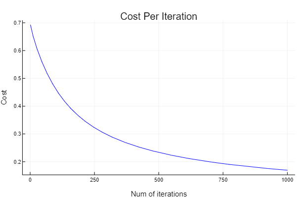

# Logistic-Regression-from-Scratch
We implement logistic regression from scratch using Julia

Files in this repo - 
* .mat - These files contain datasets used in this project
* Logistic Regression.ipynb - This is a Jupyter Notebook containing all the code for this project
* Logistic Regression Paper.pdf - Paper with background on logistic regression. Highly recommended to this beforehand

# Introduction
This repo will outline all the code that is used to implement logistic regression from scratch

# Results

Binary classification - 
  

One VS All Classification - 
