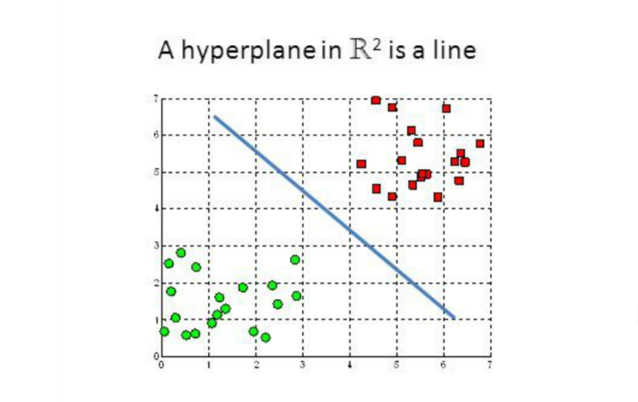

# Logistic-Regression-from-Scratch
We implement logistic regression from scratch using Julia

---
author:
- Rohit Malhotra
title: Logistic Regression and Data Analysis in Machine Learning
---

# Introduction

## Motivation

This paper is written for those who want a peek into some of the
fundamentals of Machine Learning. More specifically, we will examine
Logistic Regression, a very popular and powerful algorithm. The paper
can be understood by those who have a basic idea of linear algebra, and
the rest of the deeper mathematics required to implement this algorithm
will be explained through intuition.\
\
Hopefully, by the end of this paper we can implement this algorithm from
scratch, and gain an insight into process behind designing and creating
machine learning solutions.

## The Rise of Machine Learning

Machine Learning has existed since the 1950's. However, only until
recently have we acquired the resources to store immense amounts of
data. With the added benefits of faster computers, Machine Learning has
started to flourish from research to business applications.\
\
There are many ways to categorize machine learning: supervised learning,
unsupervised learning, reinforcement learning, semi-supervised learning
and more. As previously mentioned, we will take a look at one Machine
Learning algorithm [Logistic Regression]{.underline}, which is a
"[supervised learning algorithm]{.underline}\".

## Expectations

Throughout this paper, we will take a look at many equations that will
build the foundations for Logistic Regression. Often, these equations
will have summations over many training samples (rows of data from a
given dataset). The most basic ways to implement these algorithms would
be to use for-loops. However, given the amount of data we operate with
we need a faster way to compute many of these equations. Thus, we will
"vectorize\" these calculations, or substitute these for-loops with
matrix operations, during our implementation. While this is an abstract
explanation and we haven't taken a look at any concrete examples yet,
the expectation is to have at least basic understanding of linear
algebra.

# Problem Statement

## Dealing with Classification

$\newline \\$ A popular goal of Machine Learning is classification,
where we create a model that can take data which it hasn't seen before
and give it a label. Here are some examples of classification problems -

-   Determining whether or not an email is a spam email

-   Given data about a cancer patient, determine whether their tumor is
    malignant or benign

-   Given an image, determine whether or not it has a car in it

$\newline$ These are all binary classification problems, where we can
for example classify an email as not spam or spam (0 or 1).

## Supervised Learning

Now the inevitable question arises, how do we begin to write a program
that can act as a classifier? Before that we must learn about the type
of algorithm we are going to be building.\
\
Supervised Learning is when we create a Machine Learning model through
labelled data. Data is labelled when the expected data outputs have been
provided for every input. Another way of thinking about it is, for every
x we have been provided with y. Let's a take a look at some labelled
data we could use to train a classifier.\
\
A company want's to create a machine that can figure out whether they
want to employee a new person. They look at their past history of
employment and collect the following data -

   X (Highest Degree)   Y (Employed or not)
  -------------------- ---------------------
      High School                0
       Undergrad                 1
        Masters                  0
       Undergrad                 0
          PHD                    1

$\newline \\$ Here $``1"$ in the Y column represents whether the person
got hired. One of the biggest challenges of Machine Learning is to
create optimal dataset we can use for training models from the massive
stores of data we possess today.\
\
This dataset is incredibly small to actually train a Machine Learning
model. Realistically, the data is more complex and a lot larger. A more
realistic example can look like the following -\

   Highest Degree   Years of Experience   Criminal Record   Y
  ---------------- --------------------- ----------------- ---
    High School              0                  No          0
     Undergrad              10                  Yes         1
      Masters                4                  No          0
     Undergrad               2                  No          0
        PHD                  4                  No          0

$\newline \\$ Notice, we aren't restrained to having just one X column.
We can have many X columns, or "features\", which we feed to the model
so it can learn to classify better.

# Logistic Regression

Finally, are going to learn the method by which we can classify data.

## Fitting the Hyperplane

The goal of logistic regression is to fit a hyperplane through the
feature space. This might be a duanting sentence but let's break it up.\
\
Let's first define a hyperplane. Given a $\mathbb{R}^n$ subspace, a
hyperplane is a subspace in $\mathbb{R}^{n-1}$. Here is a hyperplane for
$\mathbb{R}^2$, which is a line

{width="\\textwidth"}

Similarly, a hyperplane for $\mathbb{R}^{3}$ would be a plane\
{width="\\textwidth"} Notice, in these
pictures we have two clusters of data. The axis are our features, and
the hyperplane is dividing these clusters. This is the goal of logistic
regression - to know which hyperplane will optimally help us
differentiate these clusters.

## Defining the Model

Now that we understand the goal of logistic regression, let's dive
deeper into how we can build our desired hyperplane.\
\
Let's consider the equation of a line: $y = \theta_{1}x + \theta_{0}$\
Here is a vectorized implementation for the equation of a line:\
Let $\theta  = \begin{bmatrix} \theta_{0} \\ \theta_{1} \end{bmatrix}$
and $X = \begin{bmatrix}
1 \\ x
\end{bmatrix}$\
\
Then $y = \theta^TX = \begin{bmatrix}
\theta_{0} & \theta_{1}
\end{bmatrix}\begin{bmatrix} 1 \\ x \end{bmatrix} = \theta_{0} + \theta_{1}x$\
\
This can be generalized for all linear equations:
$y = \theta_{0} + \theta_{1}x_{1} + \cdots + \theta_{n}x_{n}$\
Let
$\theta  = \begin{bmatrix} \theta_{0}\\ \theta_{1} \\ \vdots \\ \theta_{n} \end{bmatrix}$
and $X = \begin{bmatrix}
1 \\ x_{1} \\ \vdots \\ x_{n}
\end{bmatrix}$\
\
Then
$y = \theta^TX = \begin{bmatrix} \theta_{0} & \theta_{1} & \cdots & \theta_{n} \end{bmatrix}\begin{bmatrix}
1 \\ x_{1} \\ \vdots \\ x_{n}
\end{bmatrix} = \theta_{0} + \theta_{1}x_{1} + \cdots + \theta_{n}x_{n}$
$\newline \\ \\$ Notice that X is a row of a given dataset, so every
\"feature\" or column of the data has a value of theta value associated
with it. This gives us multidimensional linear models.\
\
Now that we know what a linear model looks like, let's take a look at a
whether we can use it to build a classifier. We want the model to give
us the probability of whether a given data is either 0 or 1.\

::: center
{width="7cm" height="7cm"}
:::

$\newline$ This model isn't very helpful. Notice that to classify
whether something is 0 or 1, we need a probability. If it's 50% or less,
we'll classify it as 0, and more than 50% becomes 1. However, using a
line overshoots this (for example you can't have negative
probabilities), making it impractical for our use.\
\
Thus, we can utilize a function known as the sigmoid function. It is
defined as the following function $$\sigma(x) = \frac{1}{1+e^{-x}}$$ and
looks like the following graph.

::: center
{width="\\textwidth"}
:::

This function always returns a value between 0 and 1, which can be
interpreted as a probability. For logistic regression, we can take a
linear model and put it through the sigmoid function, giving us the
following equation.\
$$h_{\theta}(X) = \frac{1}{1+e^{-\theta^TX}}$$

::: center
{width="7cm" height="7cm"}
:::

Thus, we get the following summary. Our logistic regression model is
defined by $h_{\theta}(X)$, which now returns us a probability between 0
and 1.

{#fig:my_label
width="\\textwidth"}

## Idea of Cost

The idea of cost is to create a metric by which we can measure how
"error prone\" our model is. Notice, this is not the same as measuring
the accuracy of our model. Although they are somewhat correlated and
similar, we do both in Machine Learning.\
\
In Machine Learning, finding the cost of model is standard practice.
Given one data sample, in logistic regression we can calculate the cost
through the following equation -\
$$Cost(x) = -y\log{h_{\theta}(X)} + (1-y)(1-h_{\theta}(X))$$\
Now that we have found a way to evaluate the cost of one data sample, we
want find the average cost over our entire dataset, which gives us a
more general understanding for how error prone the model is. We do this
by the following equation

$$\text{Cost:} \ J(\theta) = -\frac{1}{m}\sum_{i=1}^m y^{(i)} \log{h_{\theta}(x^{(i)})} + (1-y^{(i)})\log{1-h_{\theta}(x^{(i)})}$$\
The goal is minimize this cost, $J(\theta)$

## Gradient Descent

We know know the definition of Logistic Regression model, and how to
evaluate the model. However, we haven't yet learned how to find the
parameters $\theta$ which lower our cost.\
\
We do this through "training\" our model, or a process by which we find
the optimal theta values for our model.\
\
There are many ways to do this, but we will take a look at a popular
algorithm gradient descent. In this algorithm, we are looking to find
the global minumum of cost given some theta parameters.\
\
Finally, for those who are experienced with calculus, one way to
converge to the global minimum is to take the partial derivative with
respect to theta. Then, we add this gradient to theta, which will
optimize it closer towards the global minimum. This gives us the
following equations

$$\theta_{j} := \theta_{j} - \alpha \frac{\partial}{\partial \theta_{j}}J(\theta)$$\
After evaluating the partial derivative we get -\
$$\theta_{j} := \theta_{j} - \frac{\alpha}{m}\sum_{i=1}^m (h_{\theta}(x^(i)) - y^{(i)})x^{i}_j$$
where $1 \le j \le n$ and n is the number of features and $\alpha$ is
the learning rate (a predetermined constant value).

# A Practical Look

The links to the data and code used to implement this will be provided
in the appendix.

## Examining Data

Let's load the binary classification dataset into Julia. Here's a small
sample from the dataset. We do this through the following code -\

   Feature 1   Feature 2   Classification
  ----------- ----------- ----------------
    1.9643      4.5957           1
    2.2753      3.8589           0
    2.9781      4.5651           0
     2.932      3.5519           1
    3.5772       2.856           1
     4.015      3.1937           1
    3.3814      3.4291           0

$\newline \\$ Graphing feature 1 and feature 2 gives us the following
graph.

{width="\\textwidth"} From just the
graph it is apparent that there seems to be two distinct clusters. The
goal will be to fit a hyperplane in this feature space such that we can
divide the two clusters.

## Training vs Testing Split

A practical idea in Machine Learning is taking a dataset and splitting
it two datasets, one specifically for training and the other for
testing. Imagine that you are learning how to drive by practicing in
your neighborhood. You might learn to recognized certain sharp turns or
stop signs, making you a good driver. However, this does not mean you
can drive everywhere in the world. To check whether you are a good
driver, we expect you drive well in places you haven't seen before.\
\
Similarly, the model is trained using a training dataset. The testing
dataset is some small amount of data the model has never seen before. We
can judge its accuracy over this dataset to determine whether our model
is generalized and accurate.\
\
For this data, we will use 80% of the data for training and %20 for
testing.

## Training a model

Using what we have learned so far, we can successfully train a model. At
every step of gradient descent (which we perform many, many times), we
can keep track of our cost. Here is the history of my cost as I trained
my model -\

{width="\\textwidth"}
[\[fig:my_label\]]{#fig:my_label label="fig:my_label"}

Visually speaking the model looks promising based on the overall cost
decreasing at every iteration. However, if the cost becomes too low then
it might suggest that we have successfully learned everything about the
training dataset, but it's performance on the testing dataset might be
worse.

## Evaluating Accuracy

Informally, we can test whether our model did well by visualizing the
hyperplane it created.

{width="\\textwidth"} $\newline$ The
model learned which line would best divide the clusters. This type of
accuracy evaluation only works with two dimensional features. For a more
concrete metric, we will evaluate the accuracy of our model over our
testing data.

We can do this using the following steps -

-   Train our model

-   Run the model over the data in the testing dataset (predictions)

-   Find the percentage of predictions that were accurate with the label

Thus, the total accuracy we got was -

# Multiclass Classification

## One VS All Classification

We have looked at creating a binary classification model. However, what
if we have more than just two clusters or labels?\
Here we use one versus all classification. The idea is to choose one
label, make it 1 and set all the other labels to 0. Then we train a
binary classification logistic regression model. Similarly, we repeat
this process for all the labels, making our desired label 1 and the rest
0. This will result in the same number of binary classification models
as the number of labels.\
The idea is to differentiate just one label from all the other labels,
hence the name one versus all.

## One VS All Prediction

Now that we have many binary classification models, how do we predict a
data sample's label?\
The answer is to run the data sample through all of the models. The
model which returns the highest probability, or degree of confidence, is
the model we choose as the most accurate. This label that is associated
with this model becomes the same label predicted for the data sample.

# Another Practical Look

This time we will be classifying handwritten digits.

## Examining Data

Taking a look at just one data sample is going to be tough since it is
an image. The dataset has $5000$ samples and $400$ features.\
\
$5000 \Bigg\{$
$\underbrace{\begin{bmatrix} Image_{1} \\ Image_{2} \\ \vdots \\ Image_{5000} \end{bmatrix}}_{400}$

Here every feature is a pixel. An arbitrary data sample is just a
flattened 400 pixel image and looks like the following -\
$Image_{i} = \underbrace{\begin{bmatrix} pixel_{1} & pixel_{2} & \cdots & pixel_{400}\end{bmatrix}}_{400 \ \text{pixels}}$\
So can take a 400 pixel flattened image, and reshape it into a
$20 \times 20$, which will help us visualize the image. Taking a few
random samples we get the following images -

{width="\\textwidth"}

Taking a look at just one of the images we get the following picture -

{width="\\textwidth"} Notice, both the x and y
axis go from 0 to 20, which means the image is in fact a
$20 \times 20 = 400$ pixel image

## Training vs Testing Split

Similar to the first practical example, we will create a 80/20 split.
80% of the data will be used for training the other 20% will be used to
evaluate the accuracy of our model.

## Training a Model

This time we train a model for every digit. During this training
process, the one label will be set to 1 and the rest will be set to 0.
Doing this for every label will give us 10 different models. Here are
the graphs for the history their cost while training -

{width="\\textwidth"}
[\[fig:my_label\]]{#fig:my_label label="fig:my_label"}

Here label 1 represents the digit 0, label 2 is the digit 1, and so on.
All of the ten binary classification models seem to be fairly optimized
since their cost has decreased.

## Evaluating Accuracy

We will perform predictions over our testing dataset. The accuracy of
the models trained resulted in the overall accuracy of

# Visualizing Data: PCA

## Motivation

As we have seen, the data that we could potentially use for training
logistic regression models can be incredibility complex and high
dimensional. Not all data can be modelled using logistic regression.
Even though it worked for hand written digits, often in Machine Learning
we aren't entirely sure.\
Something that always helps is visualizing the data. Besides the pros of
dimensional reduction we have learned in class, this is another
motivational aspect of it.

## PCA Analysis

To perform PCA Analysis we perform the following steps -

-   We first find the center for the data. This means we average every
    column in the matrix $D$ to find the mean value for every feature

-   We find the covariance matrix (more on this later)

-   We calculate the eigenvalues and their eigenvectors for the
    covariance matrix

-   We choose the eigenvectors that have the largest eigenvalues to form
    the matrix $W$

-   Then we calculate to $W^TD^T$ to reduce the dimensions of the data

Here is an example for the following dataset -

## Visualizing Handwritten Digits

After performing PCA Anlaysis here are some results -

{width="\\textwidth"}
[\[fig:my_label\]]{#fig:my_label label="fig:my_label"}

Here is a 2D reduction of some random samples from our dataset. This
random sample has the digits from 0 to 5. Just looking visually, we can
see there are some clusters for each digit.\
However, they seem to overlap a lot. This is expected since we lost a
lot of data from reducing the dimensions of the data. However, the most
important aspects of the dataset were retained, giving us a 2 pixel
representation of an image.\
Similarly, if we reduce the same data to 3D we get some of the following
graphs

  ------------------------------------------- -------------------------------------------
  {width="7cm"}   {width="7cm"}
  ------------------------------------------- -------------------------------------------

[\[Fig:Race\]]{#Fig:Race label="Fig:Race"}

Here we are comparing a three pixel representation between the 0/5
digits, and the 0/1 digits.

{width="\\textwidth"}
[\[fig:my_label\]]{#fig:my_label label="fig:my_label"}

For this example, there seems to be two distinct clusters between the 0
digit and the 3 digit. This concludes the paper.

# Appendix

[[Link to
code/data]{style="color: blue"}](https://github.com/malhotra5/Logistic-Regression-from-Scratch)

1\. Supervised Learning: A process by which labelled data is used to
train a Machine Learning model. Data is labelled when expected data
outputs have been provided every data inputs.
